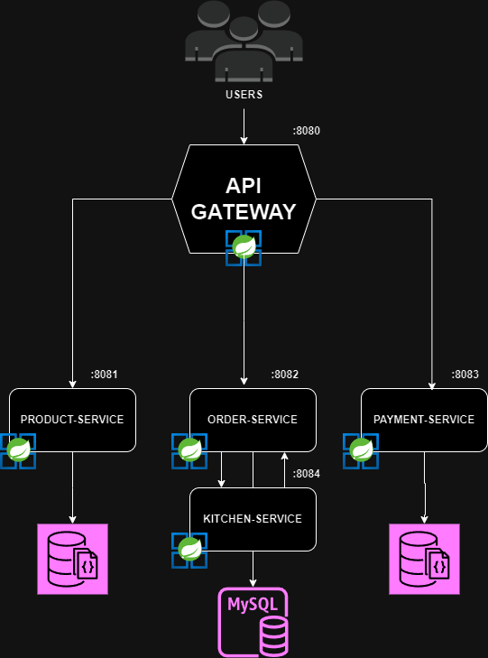
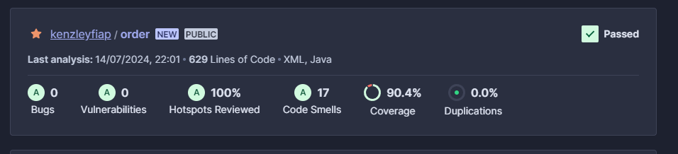

# Order-Service
Serviço responsável por operacionalizar o processo de pedidos, registrando os pedidos, retornando as informações necessárias para montar um pedido, listando os pedidos registrados e em processo de produção

### Arquitetura


### Evidência sonar


## Comandos para rodar os testes

<b>Testes de integração
```
mvn test -P integration-test
```
<b>Testes de sistema
```
mvn test
```
<b>BDD test
```
mvn test -P system-test
```

## Swagger

```
http://localhost:8082/swagger-ui/index.html
```

# Entregável fase 04
### Para essa fase 04 do projeto, estamos implementando os seguintes desafios:
* Quebra do Monolíico em Microserviços conforme a arquitetura acima
* Implementação de qualidade de código com sonar

